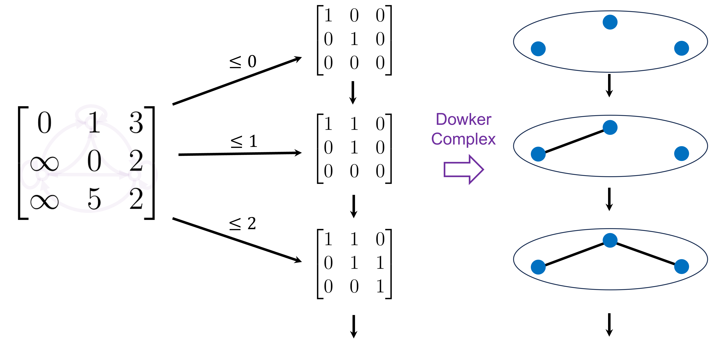
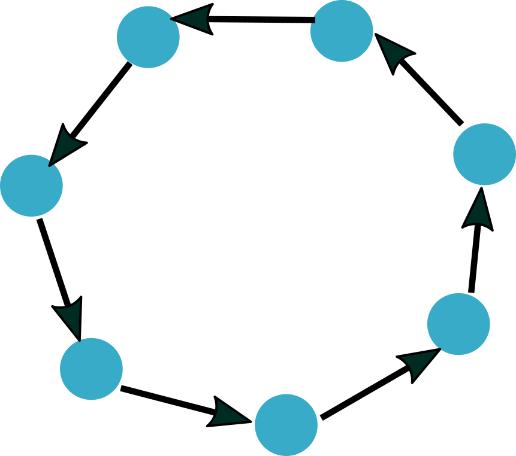
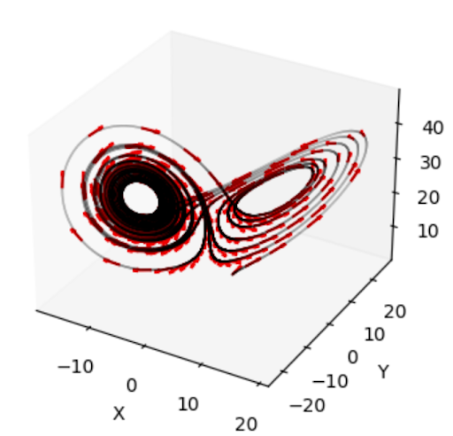

<!-- ------------------------------------------------------- -->
<!-- DO NOT REMOVE -->

```{r setup, include=FALSE}
library(knitr)
options(htmltools.dir.version = FALSE)
knitr::opts_chunk$set(echo = FALSE)
knitr::opts_chunk$set(fig.align = 'center')
```

```{r xaringan-panelset, echo=FALSE}
xaringanExtra::use_panelset()
```

```{r xaringan-tile-view, echo=FALSE}
xaringanExtra::use_tile_view()
```

```{r xaringan-tachyons, echo=FALSE}
xaringanExtra::use_tachyons()
```

```{r xaringanExtra-freezeframe, echo=FALSE}
xaringanExtra::use_freezeframe(
  selector = ".freeze-gif",
  trigger = "click",
  overlay = TRUE,
  responsive = TRUE
)
```

```{r xaringan-editable, echo=FALSE}
xaringanExtra::use_editable(expires = 1)
```

```{r xaringan-scribble, echo=FALSE}
xaringanExtra::use_scribble()
```

<!-- ------------------------------------------------------- -->
<!-- Adjust collaborator image size and position (DO NOT INSERT ANY CODE ABOVE THIS)-->

# Team


---
# Motivation

- Atmospheric flows are characterized by chaotic dynamics and recurring large-scale patterns (weather regimes).

- Sea Level Pressure and Geopotential Height are representative fields for the large-scale atmospheric circulation over the North Atlantic and Europe. 

- There are 4 well-known large-scale weather regimes over the North Atlantic: 

- North Atlantic oscillation (NAO): NAO+, NAO-,  Atlantic Ridge and
the Scandinavian blocking.

---
# Motivation


.footnote[Strommen, K., Chantry, M., Dorrington, J. et al. A topological perspective on weather regimes. Clim Dyn 60, 1415–1445 (2023). https://doi.org/10.1007/s00382-022-06395-x]

---
# Distance-Density Bifiltration


<div class="absolute right-2" style="top: 50%; transform: translateY(-50%);">
  <div class="pa3 bg-light-gray br3 shadow-1">
  How to encode sequential information?
  </div>
</div>

.footnote[Strommen, K., Chantry, M., Dorrington, J. et al. A topological perspective on weather regimes. Clim Dyn 60, 1415–1445 (2023). https://doi.org/10.1007/s00382-022-06395-x]

---
# Dynamics Aware Topology

- Use TDA to study points clouds sampled from dynamical systems.

- Rips complex on a point cloud doesn’t capture the sequential nature of the system.

- Possibility of 1-cycles with trajectories which aren’t closed/periodic. These “pseudo”-loops can give the false impression of periodicity.

---
# Lorenz Rips Persistence


---
# Asymmetric Homology Theories


---
# Overview


--


---
# Directed Flag Complexes


---
# Directed Flag Complexes

For a directed graph $G = (V, E)$, the directed flag complex of $G$ has $k$-simplices directed $k$-cliques

--


--


---
# Dowker Complexes

Dowker complexes extract topology from binary relations $R \subseteq X \times Y$

--

--

--


---
# Weighted Digraphs

.footnote[Samir Chowdhury and Facundo Memoli. A functorial Dowker theorem and persistent homology of asymmetric networks. 2018. arXiv: 1608.05432 [math.AT]. url: https://arxiv.org/abs/1608.05432.
]

We define **weighted digraphs** to be pairs $(X, w)$ where

$$w: X \times X \xrightarrow{} \mathbb{R}_{\geq 0} \cup \{\infty\}$$
--

--

--


---
# Weighted Digraph Persistence


--

--


---
# Example




--


---
# Interpretation of Dowker Barcodes

.footnote[Samir Chowdhury and Facundo M´emoli. A functorial Dowker theorem and persistent homology of asymmetric networks. 2018. arXiv: 1608.05432 [math.AT]. url: https://arxiv.org/abs/1608.05432.
]


---
# Proposition 1

TBA

---
# Proposition 2

TBA

---
# Proposition 3

TBA

---
class: center, middle

# Part II

---
# Digraphs from Phase Space

.footnote[Myers, A. D., Chumley, M. M., Khasawneh, F. A., & Munch, E. (2023). Persistent homology of coarse-grained state-space networks. Physical Review. E, 107(3). https://doi.org/10.1103/physreve.107.034303]

.pull-left[


<br><br><br><br><br><br><br><br><br><br><br>

Point Cloud Bins

Likelihood of moving from bin $x$ to bin $y$

]

.pull-right[


<br><br><br><br><br><br><br><br><br><br><br>

Nodes

Edge Weights

]

---
# Flag Persistence (Directed vs Undirected Lorenz)




--


---
# Flag Persistence Stability


--


---
# Flag Persistence (Deterministic Vs. Stochastic)


---
# Dowker Persistence Stability

TBA

---
# Dowker (Deterministic Vs. Stochastic)

TBA

---
# Dowker (Unforced vs forced Lorenz)


--


---
# Cycle Representatives

.pull-left[


]

.pull-right[


]

---
# Analogous Bars

.footnote[Yoon, H.R., Ghrist, R. & Giusti, C. Persistent extensions and analogous bars: data-induced relations between persistence barcodes. J Appl. and Comput. Topology 7, 571–617 (2023). https://doi.org/10.1007/s41468-023-00115-y
]

Given point clouds $P \subseteq \mathbb{R}^n$ and $Q \subseteq \mathbb{R}^m$ together with cross-dissimilarity measure $\mu : P \times Q \xrightarrow{} \mathbb{R}_{\geq 0}$, we can identify shared topological features


--

--

--

--


---
# Shared Features (Lorenz)


---
# Shared Features (Lorenz)


--

--


---
# Shared Features (Lorenz)


---
# Shared Features (ENSO and PDO)


--


---
# Shared Features (ENSO and PDO)


--

--


---
# Future Directions


---
class: center, middle

# Thank You!